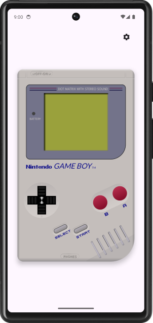
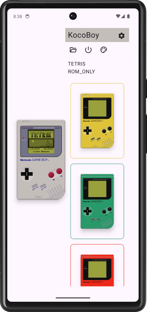
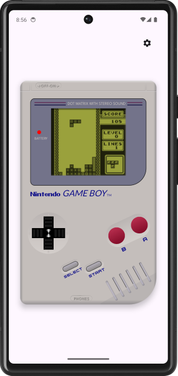

# KocoBoy
An experimental Kotlin Multiplatform, Compose Multiplatform, GameBoy Emulator that targets Android, iOS, Desktop and JS/WASM.

<table>
  <tr>
    <td width="33%"> </td>
    <td width="33%"></td>
    <td width="33%"></td>
   </tr> 
</table>

> [!NOTE]  
> KocoBoy can run many games, demos and tests but it is not a M-Cycle or micro-ops accurate emulator.  
> Accuracy and syncronization between the various memory mapped devices relies on hardcoded fixed values and varies from 4 to 24 CPU cycles depending on the executed opcode or hardware interrupt.

## Compatibility

Game Boy catalog compatibility support is focused on the most popular cartridges types (MBCs 1,2,3 and 5).  
The full list goes as follows:

|Supported Cartridge Types  | Unsupported Cartridge Types |
|--|--|
|00h  ROM ONLY  |  08h  ROM+RAM |
|01h  MBC1  |  09h  ROM+RAM+BATTERY |
|02h  MBC1+RAM  |   0Bh  MMM01|
|03h  MBC1+RAM+BATTERY  |  0Ch  MMM01+RAM |
|05h  MBC2  |  0Dh  MMM01+RAM+BATTERY |
|06h  MBC2+BATTERY  | 1Ch  MBC5+RUMBLE |
|0Fh  MBC3+TIMER+BATTERY  | 1Dh  MBC5+RUMBLE+RAM |
|10h  MBC3+TIMER+RAM+BATTERY  | 1Eh  MBC5+RUMBLE+RAM+BATTERY |
|11h  MBC3  | 20h  MBC6 |
|12h  MBC3+RAM  | 22h  MBC7+SENSOR+RUMBLE+RAM+BATTERY |
|13h  MBC3+RAM+BATTERY  | FCh  POCKET CAMERA |
|19h  MBC5  | FDh  BANDAI TAMA5 |
|1Ah  MBC5+RAM  | FEh  HuC3 |
|1Bh  MBC5+RAM+BATTERY  |  FFh  HuC1+RAM+BATTERY |

> [!NOTE]  
> SRAM save files are not supported at the moment so your progress on games will be lost on exit.

## Using the emulator

Run the App, Click the cog / settings icon to see the sidebar.  
On the sidebar you can Load a rom, Power On/Off or select a theme.  
Click again the cog / settings icon to collapese the sidebar.  
 
On platforms with touch input you can actually use the UI as an input.  
On platforms with keyboard input is mapped as:

* D-Pad UP: **W**
* D-Pad Left: **A**
* D-Pad Down: **S**
* D-Pad Right: **D**
* A: **K**
* B: **L**
* Start: **P**
* Select: **O**

## About the project
The project is splitted in 2 modules:  
**core:** It contains just commonMain Kotlin code. It represents the full emulator core with CPU, PPU, Bus and other components.  
**composeApp:** A Compose Multiplatform gradle module it is mainly a commonMain centric module with a couple of per platform functions, for image and audio handling.

## Known issues
This is nowhere a full list of issues just some of them from a high view perspective:
* iOS lacks sound output (yet)
* Main loop and audio sync have quite room for improvement.

## FAQ

- Can i use this emulator to play?

Yes you can, but you shouldn't. There are a lot of other more capable emulators out there.  
This is just a personal project to play with Kotlin Multiplatform / Compose Multiplatform

- Why parts of the core code use unsigned while others use signed masking?

Never been a fan of Kotlin approach to unsigned. When you add limited infix bitwise operators to the mix you end on quite messy code.  
But then I learned that on KMP the inline classes actually get lowered to native primitives and even on the JVM/Android/R8 can produce better bytecode. (thanks [Kotlin Explorer](https://github.com/romainguy/kotlin-explorer)!)  
By that time the CPU was already finished, so yeah... I should rewrite the masked part to unsigned even if some parts are experimental and the developer experience is not the best.

- How is performance overall for an emulator?

At it's current iteration it can trigger around 2800vps, so around 46x the real device running on a phone while running uncapped. (tested on a Pixel 6).

- Why sometimes it hiccups on audio or it goes below 60 when capped?

Apparently I'm kinda bad at writing main loops (also delay may be not the best tool there as it behaves differently per platform...)

- Why did you *insert random thing here* on that way? I can totally do it better!

Make a pull request!

- But... I have questions!

Ask on the [Emudev Discord Server](https://discord.com/invite/dkmJAes)

