# Test status

Generated by running every test ROM in `kocoboy-core/src/jvmTest/resources/roms`, do not edit by hand. Regenerate with

```
KOCOBOY_TEST_PAGE=1 ./gradlew :kocoboy-core:jvmTest --tests '*TestStatusPage*' --rerun
```

Kocoboy emulates the original Game Boy (DMG). It passes **125 of 138** DMG test ROMs, 10 more check other models and are expected to fail.

## dmg-acid2

| Kocoboy | Reference |
|---|---|
|  |  |

Every pixel matches the reference.

## By folder

| Folder | Passed | Other hardware |
|---|---|---|
| `mooneye/acceptance` | 32 / 32 | 9 |
| `mooneye/acceptance/bits` | 3 / 3 |  |
| `mooneye/acceptance/instr` | 1 / 1 |  |
| `mooneye/acceptance/interrupts` | 1 / 1 |  |
| `mooneye/acceptance/oam_dma` | 3 / 3 |  |
| `mooneye/acceptance/ppu` | 6 / 12 |  |
| `mooneye/acceptance/serial` | 1 / 1 |  |
| `mooneye/acceptance/timer` | 13 / 13 |  |
| `mooneye/emulator-only/mbc1` | 13 / 13 |  |
| `mooneye/emulator-only/mbc2` | 7 / 7 |  |
| `mooneye/emulator-only/mbc5` | 8 / 8 |  |
| `blargg/cpu_instrs` | 1 / 1 |  |
| `blargg/cpu_instrs/individual` | 11 / 11 |  |
| `blargg/dmg_sound` | 1 / 1 |  |
| `blargg/dmg_sound/rom_singles` | 12 / 12 |  |
| `blargg` | 1 / 1 |  |
| `blargg/instr_timing` | 1 / 1 |  |
| `blargg/interrupt_time` | 0 / 0 | 1 |
| `blargg/mem_timing-2` | 1 / 1 |  |
| `blargg/mem_timing-2/rom_singles` | 3 / 3 |  |
| `blargg/mem_timing/individual` | 3 / 3 |  |
| `blargg/mem_timing` | 1 / 1 |  |
| `blargg/oam_bug` | 0 / 1 |  |
| `blargg/oam_bug/rom_singles` | 2 / 8 |  |
| **Total** | 125 / 138 | 10 |

## Every test

### `mooneye/acceptance`

| Test | Result | Screen |
|---|---|---|
| add_sp_e_timing | ✅ | 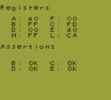 |
| boot_div-S | ➖ |  |
| boot_div-dmg0 | ➖ | 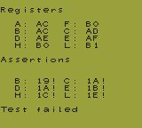 |
| boot_div-dmgABCmgb | ✅ | 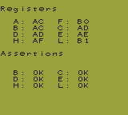 |
| boot_div2-S | ➖ | 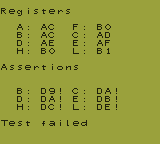 |
| boot_hwio-S | ➖ | 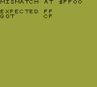 |
| boot_hwio-dmg0 | ➖ | 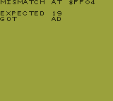 |
| boot_hwio-dmgABCmgb | ✅ |  |
| boot_regs-dmg0 | ➖ | 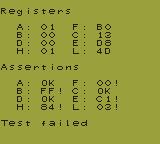 |
| boot_regs-dmgABC | ✅ | 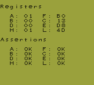 |
| boot_regs-mgb | ➖ | 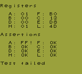 |
| boot_regs-sgb | ➖ | 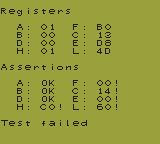 |
| boot_regs-sgb2 | ➖ | 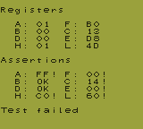 |
| call_cc_timing | ✅ |  |
| call_cc_timing2 | ✅ | 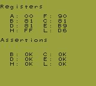 |
| call_timing | ✅ |  |
| call_timing2 | ✅ | 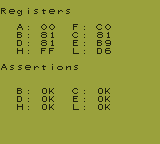 |
| di_timing-GS | ✅ |  |
| div_timing | ✅ | 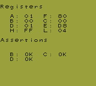 |
| ei_sequence | ✅ | 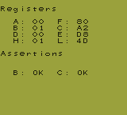 |
| ei_timing | ✅ | 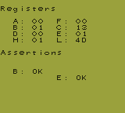 |
| halt_ime0_ei | ✅ |  |
| halt_ime0_nointr_timing | ✅ | 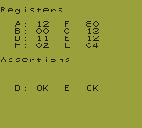 |
| halt_ime1_timing | ✅ | 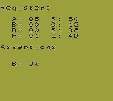 |
| halt_ime1_timing2-GS | ✅ | 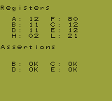 |
| if_ie_registers | ✅ | 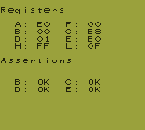 |
| intr_timing | ✅ | 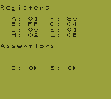 |
| jp_cc_timing | ✅ |  |
| jp_timing | ✅ |  |
| ld_hl_sp_e_timing | ✅ |  |
| oam_dma_restart | ✅ | 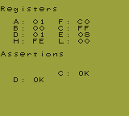 |
| oam_dma_start | ✅ | 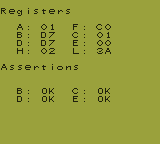 |
| oam_dma_timing | ✅ |  |
| pop_timing | ✅ | 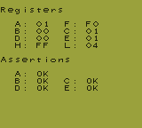 |
| push_timing | ✅ | 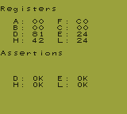 |
| rapid_di_ei | ✅ | 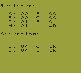 |
| ret_cc_timing | ✅ |  |
| ret_timing | ✅ |  |
| reti_intr_timing | ✅ | 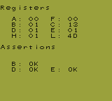 |
| reti_timing | ✅ |  |
| rst_timing | ✅ | 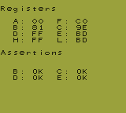 |

### `mooneye/acceptance/bits`

| Test | Result | Screen |
|---|---|---|
| mem_oam | ✅ |  |
| reg_f | ✅ | 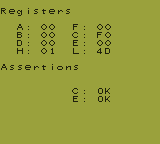 |
| unused_hwio-GS | ✅ |  |

### `mooneye/acceptance/instr`

| Test | Result | Screen |
|---|---|---|
| daa | ✅ |  |

### `mooneye/acceptance/interrupts`

| Test | Result | Screen |
|---|---|---|
| ie_push | ✅ |  |

### `mooneye/acceptance/oam_dma`

| Test | Result | Screen |
|---|---|---|
| basic | ✅ |  |
| reg_read | ✅ |  |
| sources-GS | ✅ |  |

### `mooneye/acceptance/ppu`

| Test | Result | Screen |
|---|---|---|
| hblank_ly_scx_timing-GS | ❌ | 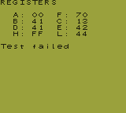 |
| intr_1_2_timing-GS | ✅ |  |
| intr_2_0_timing | ✅ | 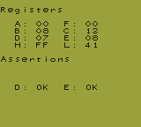 |
| intr_2_mode0_timing | ✅ | 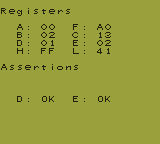 |
| intr_2_mode0_timing_sprites | ❌ | 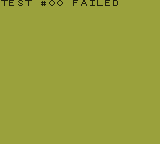 |
| intr_2_mode3_timing | ✅ | 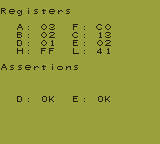 |
| intr_2_oam_ok_timing | ❌ | 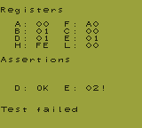 |
| lcdon_timing-GS | ❌ | 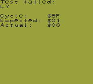 |
| lcdon_write_timing-GS | ❌ | 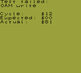 |
| stat_irq_blocking | ✅ |  |
| stat_lyc_onoff | ✅ |  |
| vblank_stat_intr-GS | ❌ | 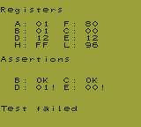 |

### `mooneye/acceptance/serial`

| Test | Result | Screen |
|---|---|---|
| boot_sclk_align-dmgABCmgb | ✅ | 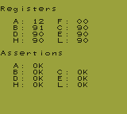 |

### `mooneye/acceptance/timer`

| Test | Result | Screen |
|---|---|---|
| div_write | ✅ |  |
| rapid_toggle | ✅ |  |
| tim00 | ✅ |  |
| tim00_div_trigger | ✅ |  |
| tim01 | ✅ | 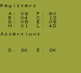 |
| tim01_div_trigger | ✅ | 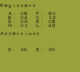 |
| tim10 | ✅ | 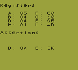 |
| tim10_div_trigger | ✅ | 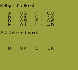 |
| tim11 | ✅ |  |
| tim11_div_trigger | ✅ |  |
| tima_reload | ✅ | 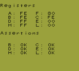 |
| tima_write_reloading | ✅ | 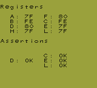 |
| tma_write_reloading | ✅ | 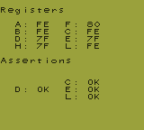 |

### `mooneye/emulator-only/mbc1`

| Test | Result | Screen |
|---|---|---|
| bits_bank1 | ✅ |  |
| bits_bank2 | ✅ |  |
| bits_mode | ✅ |  |
| bits_ramg | ✅ |  |
| multicart_rom_8Mb | ✅ |  |
| ram_256kb | ✅ |  |
| ram_64kb | ✅ |  |
| rom_16Mb | ✅ |  |
| rom_1Mb | ✅ |  |
| rom_2Mb | ✅ |  |
| rom_4Mb | ✅ |  |
| rom_512kb | ✅ |  |
| rom_8Mb | ✅ |  |

### `mooneye/emulator-only/mbc2`

| Test | Result | Screen |
|---|---|---|
| bits_ramg | ✅ |  |
| bits_romb | ✅ |  |
| bits_unused | ✅ |  |
| ram | ✅ | 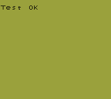 |
| rom_1Mb | ✅ |  |
| rom_2Mb | ✅ |  |
| rom_512kb | ✅ |  |

### `mooneye/emulator-only/mbc5`

| Test | Result | Screen |
|---|---|---|
| rom_16Mb | ✅ |  |
| rom_1Mb | ✅ |  |
| rom_2Mb | ✅ |  |
| rom_32Mb | ✅ |  |
| rom_4Mb | ✅ |  |
| rom_512kb | ✅ |  |
| rom_64Mb | ✅ |  |
| rom_8Mb | ✅ |  |

### `blargg/cpu_instrs`

| Test | Result | Screen |
|---|---|---|
| cpu_instrs | ✅ | 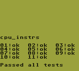 |

### `blargg/cpu_instrs/individual`

| Test | Result | Screen |
|---|---|---|
| 01-special | ✅ |  |
| 02-interrupts | ✅ | 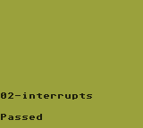 |
| 03-op sp,hl | ✅ | 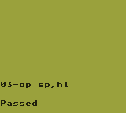 |
| 04-op r,imm | ✅ |  |
| 05-op rp | ✅ |  |
| 06-ld r,r | ✅ |  |
| 07-jr,jp,call,ret,rst | ✅ |  |
| 08-misc instrs | ✅ |  |
| 09-op r,r | ✅ |  |
| 10-bit ops | ✅ |  |
| 11-op a,(hl) | ✅ | .png) |

### `blargg/dmg_sound`

| Test | Result | Screen |
|---|---|---|
| dmg_sound | ✅ |  |

### `blargg/dmg_sound/rom_singles`

| Test | Result | Screen |
|---|---|---|
| 01-registers | ✅ |  |
| 02-len ctr | ✅ |  |
| 03-trigger | ✅ |  |
| 04-sweep | ✅ |  |
| 05-sweep details | ✅ |  |
| 06-overflow on trigger | ✅ |  |
| 07-len sweep period sync | ✅ |  |
| 08-len ctr during power | ✅ |  |
| 09-wave read while on | ✅ |  |
| 10-wave trigger while on | ✅ |  |
| 11-regs after power | ✅ |  |
| 12-wave write while on | ✅ |  |

### `blargg`

| Test | Result | Screen |
|---|---|---|
| halt_bug | ✅ |  |

### `blargg/instr_timing`

| Test | Result | Screen |
|---|---|---|
| instr_timing | ✅ |  |

### `blargg/interrupt_time`

| Test | Result | Screen |
|---|---|---|
| interrupt_time | ➖ |  |

### `blargg/mem_timing-2`

| Test | Result | Screen |
|---|---|---|
| mem_timing | ✅ |  |

### `blargg/mem_timing-2/rom_singles`

| Test | Result | Screen |
|---|---|---|
| 01-read_timing | ✅ |  |
| 02-write_timing | ✅ |  |
| 03-modify_timing | ✅ |  |

### `blargg/mem_timing/individual`

| Test | Result | Screen |
|---|---|---|
| 01-read_timing | ✅ |  |
| 02-write_timing | ✅ |  |
| 03-modify_timing | ✅ |  |

### `blargg/mem_timing`

| Test | Result | Screen |
|---|---|---|
| mem_timing | ✅ |  |

### `blargg/oam_bug`

| Test | Result | Screen |
|---|---|---|
| oam_bug | ❌ |  |

### `blargg/oam_bug/rom_singles`

| Test | Result | Screen |
|---|---|---|
| 1-lcd_sync | ❌ |  |
| 2-causes | ❌ |  |
| 3-non_causes | ✅ |  |
| 4-scanline_timing | ❌ |  |
| 5-timing_bug | ❌ |  |
| 6-timing_no_bug | ✅ |  |
| 7-timing_effect | ❌ |  |
| 8-instr_effect | ❌ |  |
